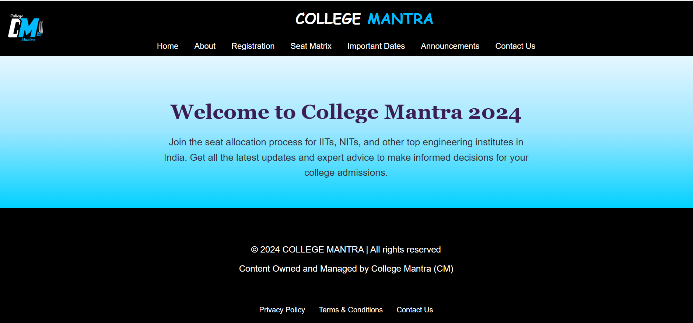
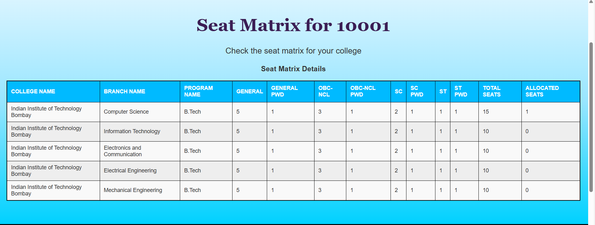
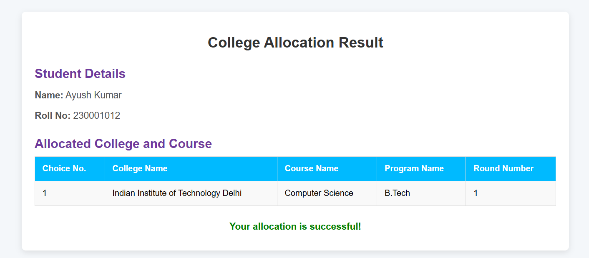
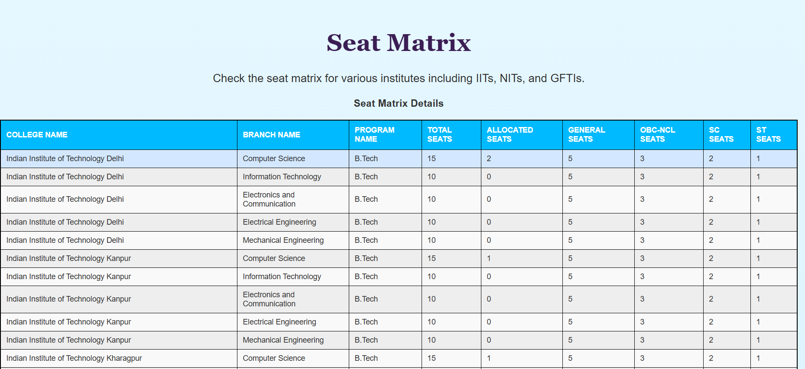
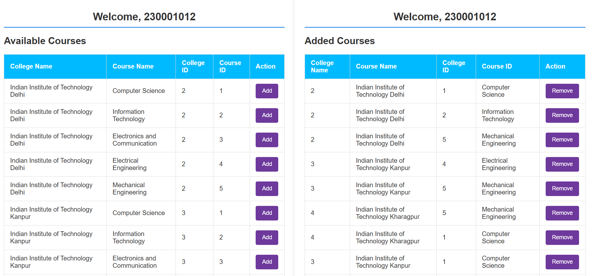
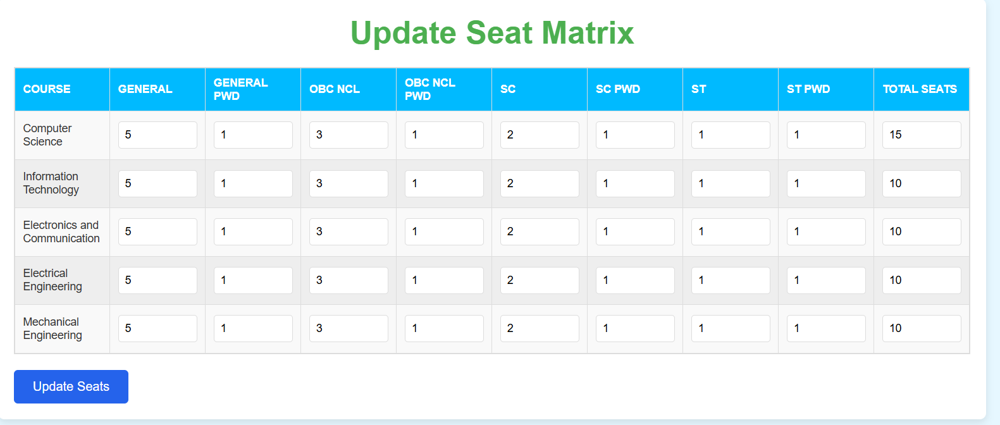
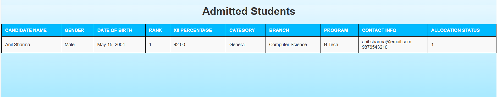

# 🎓 College Mantra - College Admission Management System

A comprehensive Django-based web application designed to streamline the college admission process through automated seat allocation, preference management, and payment processing.

## 📋 Table of Contents

- [Overview](#overview)
- [Features](#features)
- [Technology Stack](#technology-stack)
- [Screenshots](#screenshots)

## 🎯 Overview

College Mantra is a sophisticated college admission management system that automates the complex process of seat allocation based on candidate preferences, ranks, and category reservations. The system handles the entire admission workflow from candidate registration to final seat allocation and payment confirmation.

### Key Highlights:
- **Automated Seat Allocation**: Implements a merit-based allocation algorithm
- **Multi-User Support**: Separate interfaces for candidates, colleges, and administrators
- **Payment Integration**: Seamless payment processing with Razorpay
- **Real-time Updates**: Dynamic seat matrix and allocation status
- **Category-based Reservations**: Supports all major reservation categories (General, OBC, SC, ST, PwD)

## ✨ Features

### For Candidates 🎓
- **User Registration & Authentication**: Secure signup and login system
- **Profile Management**: Complete candidate profile with academic details
- **College & Course Browsing**: View available colleges and courses
- **Preference Management**: Add/remove college-course preferences
- **Real-time Allocation Status**: Check allocation results instantly
- **Payment Processing**: Simulated payment system for seat confirmation demonstration
- **Result Tracking**: View final allocation 

### For Colleges 🏫
- **College Registration**: Register college details and contact information
- **Seat Matrix Management**: Update seat availability for different categories
- **Allocation Monitoring**: Track seat allocation progress
- **Student Information**: View allocated candidates and their details

### For Administrators 🔧

- **Seat Allocation Algorithm**: Run automated allocation process
- **User Management**: Manage candidates and college accounts
- **Announcements**: Post important dates and notifications

## 🛠 Technology Stack

### Backend
- **Django 5.1.2**: Web framework for rapid development
- **Python 3.x**: Programming language
- **MySQL**: Database management system
- **Django ORM**: Object-relational mapping

### Frontend
- **HTML5/CSS3**: Structure and styling
- **JavaScript**: Interactive functionality
- **Bootstrap**: Responsive design framework

### Payment Integration
- **Simulated Payment System**: Mock payment processing for demonstration purposes

### Development Tools
- **Git**: Version control
- **Django Admin**: Built-in administration interface

## 📸 Screenshots

### Homepage & Navigation

*The main homepage showcasing the College Mantra interface with navigation options for candidates, colleges, and general information.*

### College Seat Matrix

*College interface showing the seat matrix management where colleges can view eat availability across different categories and courses.*

### Allocation Result

*Allocation results page displaying the final seat assignments and allocation status for candidates.*

### Seat Matrix Display (Students View)

*Student view of the comprehensive seat matrix showing availability across different categories (General, OBC, SC, ST, PwD) for each college-course combination.*

### Preference Management

*Candidate preference management interface allowing users to add and organize their college-course choices in order of preference.*

### Update Seat Matrix (College View)

*College interface for updating seat availability across different categories and courses in the seat matrix.*

### Admitted Students in College View

*College dashboard showing the list of admitted students and their allocation details for the respective college.*

### Seat Allocation Algorithm

The system implements a merit-based allocation algorithm:

1. **Rank-based Processing**: Candidates are processed in order of their rank
2. **Preference Matching**: For each candidate, preferences are checked in order
3. **Seat Availability**: System checks if seats are available in the preferred category
4. **Allocation**: If available, seat is allocated and matrix is updated
5. **Payment Status**: Allocation is marked as pending until payment confirmation

### Database Triggers & Stored Procedures

The system uses several MySQL triggers and a stored procedure to maintain data integrity and automate seat allocation:

- **Automatic Total Calculation**: Triggers ensure total seats are always accurate
- **Over-allocation Prevention**: Built-in checks prevent allocating more seats than available
- **Payment Integration**: Automatic status updates when payments are confirmed
- **Data Consistency**: Maintains referential integrity across all related tables

*For complete SQL setup instructions, refer to the SQL documentation file in the repository.*

### Payment Simulation Note

⚠️ **Important**: This system uses a simulated payment system for demonstration purposes. The payment buttons send POST requests to simulate payment processing, but no actual financial transactions occur.
---
